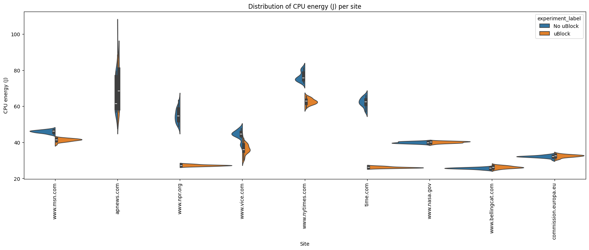

# Introduction
<!-- This problem takes another level if we are counting on these measurements to make **groundbreaking research contributions** in this area. Some research projects in the past have underestimated this issue and failed to produce replicable findings. Hence, this article presents a roadmap on how to properly set up a scientific methodology to run energy efficiency experiments. It mostly stems from my previous work on [doing research and publishing](/publications) on Green Software.

This article is divided into two main parts: 1) how to set up energy measurements with minimum bias, and 2) how to analyse and take scientific conclusions from your energy measurements.
Read on so that we can get your paper accepted in the best scientific conference. -->

Since its inception, the web has rapidly evolved from a basic information-sharing platform into a profit-driven medium, where online advertising is one of the primary revenue sources. Ads do exist for a reason. They support a significant portion of online content, as most people won't pay real money for most of what they consume. Whether it's a reputable news establishment or a niche blog, every website needs server space and developer support, which requires some degree of financial investment. 

However, the rise of online advertising has had a very negative impact on the users. Their overabundance has made the browsing experience cluttered and intrusive. Even worse is the fact that rely on invasive tracking, which exploits user data without clear consent, and also facilitates the spread of malicious websites. In response, ad blockers have become a critical tool for users aiming to improve their user experience, privacy, and security while browsing. Even the [FBI recommends ad blockers](https://www.standard.co.uk/news/tech/fbi-recommends-ad-blocker-online-scams-b1048998.html) to avoid falling prey to schemes run by potentially fraudulent websites. 

The debate around ad blockers has recently been intensified with Google Chrome’s announcement to weaken and remove many ad-blocking extensions, [including uBlock Origin](https://www.theverge.com/2024/10/15/24270981/google-chrome-ublock-origin-phaseout-manifest-v3-ad-blocker), one of the most widely used and effective ad blockers. This decision has sparked significant backlash from users who rely on these tools to improve their browsing experience. Beyond the implications for user experience and privacy, this move also raises questions about the broader impact of ad blockers on environmental efficiency and energy consumption.

Thus, in this report, we aim to explore the power consumption of web browsers with and without ad blockers. Our hypothesis is that ad blockers reduce power usage by minimizing the number of extra requests and scripts executed during browsing, thereby decreasing the computational workload needed. Some studies have previously examined the power consumption associated with ad blocking[1, 2], and generally found a significant decrease in power consumption when using these extensions, though some exceptions have shown instances of increased consumption. 

# Methodology

This report analyzes the **average power consumption** of web browsers with and without ad blockers. We focus on power consumption as it provides insight into the continuous usage of browsers over time. All measurementes are conducted using [EnergiBridge](https://github.com/tdurieux/EnergiBridge). For the measurement, we choose Joules as the unit because it provides a cumulative energy measure, which tells us exactly how much energy was consumed in total, independent of time variations.

For this study, we use Chromium version 135.0.7026.0, as it serves as the foundation for many of the most widely used browsers, including Google Chrome, Microsoft Edge, and Brave, making it a strong representative choice. Testing on Chromium ensures that the results are relevant to a broad range of browsers built on the same engine. The ad blocker tested is uBlock Origin version 1.62.0, one of the most popular extensions, with approximately 39 million downloads, according to Chrome Web Store.

### Testing setup
Our study evaluate Chromium's power consumption when browsing websites grouped by advertisement density. We classify websites into three categories — high, medium, and low ad density — with each one containing three different websites.

A **step** is defined as launching Chromium and navigating through all three websites of one category. For each **experimental trial**, we conduct six steps: three (one for each category) with uBlock Origin enabled and three without. To reduce bias, the order of website sets was randomized during each trial. Because hardware temperature can influence power consumption, the very first trial (used as a warm-up) is excluded from the final analysis. In total, we repeated this trial 30 times.

Within each step, the following actions are performed:
1) Launch Chromium through EnergiBridge.
2) Open a new tab with the designated website.
3) Wait 5 seconds to ensure all resources load completely.
4) Close tab.
5) Wait 1 second to allow the tab to close properly.
6) Repeat steps 2–5 for every website in the current set.
7) Close Chromium and wait 5 seconds before continuing to the next step.

After each trial, we reset all caches and user data genereated before continuing to the next one. Note also that we configure the startup of the browser to enable developer mode automatically, this is a necessary setting for activating uBlock Origin.

Finally, we ensure that configuration settings are kept consistent across the different devices. When executing the experiments we make sure that the laptop was in "zen mode", which includes: 
- No unnecessary applications/services running
- All external hardware disconnected from the device
- Notifications turned off
- Stable internet connection over ethernet cable
- Screen brigtness display at 100% 

### Experimental Setup

The experiments were conducted on two different devices, each equipped with distinct operating systems. By testing across multiple configurations, we can identify whether the impact of ad blocking on power usage is consistent or if it varies depending on the system. The specifications for each are specified below:

| Laptop | Acer Nitro V15               |
|--------|------------------------------|
| CPU    | AMD Ryzen 7 7735H            |
| RAM    | 32 GB                        |
| OS     | Fedora Linux 41              |

|     |                              |
|-----|------------------------------|
|     |                              |
|     |                              |
|     |                              | 
|     |                              |

## Results
> The replication package for these experiments can be found on our [Github repository](https://github.com/JortvD/cs4575-g5). 

The violin plots for the data collected are presented below (blue represents the original distribution and orange represents the distribution with removing outliers that are 1.5 IQR far from the mean):

### 1. A Lot of Ads

Set 0 refers to the websites containg a lot of ads. As can be seen the distributions are not normal. There a few possible reasons for why the distributions have two peaks.

One of them has to do with the browser cache. In particular, when these data were collected the script used to run the browser twice for each website before resetting the cache. Once with the adblock add-on and once without, chosing at random which to run first. Thus it is possible that the websites were cached the first time and then loading them the second time was faster and consumed less energy creating the two peaks for both the distributions.

Another reason has to do with the network. It is possible that sometimes the websites loaded faster and other times slower, resulting into multiple peaks.

In any case, the distributions, despite not being normal, visibly demonstrate that with the adblock (distribution 1 on the graph) less energy is spent. This was expected because the website no longer loads ads and doesn't consume any energy at displaying them.

### 2. Some Ads
.png)

Set 1 refers to websites containing some amount of ads. Some interesting observations can be made here.

For one, the second peak in the distributions no longer exists or is very tiny if outliers are included. This can possibly be explained by the caching effect not being as signifcant possibly because the websites contain less ads than before and there is less data to cache.

In addition, we still see that the browser with the adblock is clearly more energy efficient. Again this happens because the non-ad version of the website loads less resourses and displays less content. 

### 3. No Ads
.png)

Finally, set 2 refers to websites containing no ads.

As we can see again, the caching effect is minimal for these websites too for the same reasons as before.

In terms of energy efficiency, we can see that the distributions are almost identical, though maybe the adblock version is slightly worse. This was expected because these websites are the same no matter whether they are loaded with or without ads. The adblock may introduce a minimal overhead but it is not significant.

Therefore our results show that in all cases examined, using an adblock is beneficial for energy efficiency.

### All together

**Figure 1:** Distribution of total CPU energy per set

**Figure 2:** Distribution of total CPU energy per site

**Table 1: CPU Energy Consumption per set**
| Set    |   Mean (No uBlock) |   Mean (With uBlock) |   Std Dev (No uBlock) |   Std Dev (With uBlock) |   Shapiro-Wilk (No uBlock) |   Shapiro-Wilk (With uBlock) | t-test (p)   | U-test (p)   |
|:-------|-------------------:|---------------------:|----------------------:|------------------------:|---------------------------:|-----------------------------:|:-------------|:-------------|
| HIGH   |            167.109 |              137.896 |                11.508 |                  11.865 |                      0     |                        0.026 | N/A          | <0.001       |
| MEDIUM |            181.628 |              124.173 |                 3.465 |                   2.871 |                      0.622 |                        0.826 | <0.001       | N/A          |
| LOW    |             97.948 |               99.112 |                 0.95  |                   1.243 |                      0.796 |                        0.419 | <0.001       | N/A          |

**Table 2: Effect of uBlock on CPU Energy Consumption Across Ad Density Levels**
| Set    |   Mean diff (ΔX) |   Mean change (%) |   Effect size (Cohen's d) |
|:-------|-----------------:|------------------:|--------------------------:|
| HIGH   |          -29.212 |          -17.481% |                       N/A |
| MEDIUM |          -57.455 |          -31.633% |                   -18.058 |
| LOW    |            1.163 |            1.188% |                     1.052 |

**Table 3: CPU Energy Consumption Per Website**
| Domain               |   Mean (No uBlock) |   Mean (With uBlock) |   Std dev (No uBlock) |   Std dev (With uBlock) |   Shapiro-Wilk (No uBlock) |   Shapiro-Wilk (With uBlock) | t-test (p)   | U-test (p)   |
|:---------------------|-------------------:|---------------------:|----------------------:|------------------------:|---------------------------:|-----------------------------:|:-------------|:-------------|
| www.msn.com          |             45.958 |               41.294 |                 0.835 |                   0.853 |                      0.758 |                        0.061 | <0.001       | N/A          |
| apnews.com           |             66.957 |               69.932 |                 9.102 |                  11.969 |                      0     |                        0.003 | N/A          | 0.149        |
| www.npr.org          |             55.04  |               27.226 |                 3.936 |                   0.425 |                      0.474 |                        0.605 | <0.001       | N/A          |
| www.vice.com         |             44.294 |               36.205 |                 2.545 |                   2.917 |                      0.035 |                        0.809 | N/A          | <0.001       |
| www.nytimes.com      |             76.414 |               62.587 |                 2.638 |                   1.669 |                      0.103 |                        0.941 | <0.001       | N/A          |
| time.com             |             62.127 |               26.137 |                 2.568 |                   0.413 |                      0.563 |                        0.329 | <0.001       | N/A          |
| www.nasa.gov         |             39.895 |               40.058 |                 0.512 |                   0.509 |                      0.18  |                        0.505 | 0.275        | N/A          |
| www.bellingcat.com   |             25.621 |               26.211 |                 0.471 |                   0.702 |                      0.788 |                        0.944 | <0.001       | N/A          |
| commission.europa.eu |             32.104 |               32.419 |                 0.679 |                   0.797 |                      0.14  |                        0.259 | 0.124        | N/A          |

**Table 4: Effect of uBlock on CPU Energy Consumption Per Website**
| Domain               |   Mean diff (ΔX) | Mean change (%)   | Effect size (Cohen's d)   |
|:---------------------|-----------------:|:------------------|:--------------------------|
| www.msn.com          |           -4.664 | -10.148%          | -5.525                    |
| apnews.com           |            2.975 | 4.442%            | N/A                       |
| www.npr.org          |          -27.813 | -50.533%          | -9.935                    |
| www.vice.com         |           -8.089 | -18.261%          | N/A                       |
| www.nytimes.com      |          -13.827 | -18.095%          | -6.265                    |
| time.com             |          -35.99  | -57.929%          | -19.571                   |
| www.nasa.gov         |            0.163 | 0.408%            | 0.319                     |
| www.bellingcat.com   |            0.589 | 2.3%              | 0.986                     |
| commission.europa.eu |            0.315 | 0.98%             | 0.425                     |

# Conclusions and Future Works
The first observation is Ad-Blocking can substantially reduce energy usage, which supports our hypothesis that blocking ads generally decreases energy consumption. This is the most obvious with moderate ads, where using uBlock Origin produced a clear decrease in CPU energy consumption, at times exceeding a 30% reduction (see Table 2). 
When ads were entirely absent, there was virtually no benefit—and in some cases. In fact, a slight overhead—associated with running the ad blocker (Tables 1 and 2). One of the possible reason is the ad blocker consumes a fixed level of energy while operating.

In the future, we could improve based on 3 aspects:

1. Use other browsers(e.g. Firefox, Edge, Tor...) and other ad-Blocker extensions to reduce biases.

2. 

# References
[1] Khan, K. A., Iqbal, M. T., & Jamil, M. (2024). Impact of Ad Blockers on Computer Power Consumption while Web Browsing: A Comparative Analysis. European Journal of Electrical Engineering and Computer Science, 8(5), 18-24.

[2] Kent Rasmussen, Alex Wilson, and Abram Hindle. (2014). Green mining: energy consumption of advertisement blocking methods. In Proceedings of the 3rd International Workshop on Green and Sustainable Software (GREENS 2014). Association for Computing Machinery, New York, NY, USA, 38–45. https://doi.org/10.1145/2593743.2593749
<!-- #### 👉 Note 1:
If you are a **software developer** enthusiastic about energy efficiency but you are not particularly interested in scientific experiments, this article is still useful for you. It is not necessary to do "everything by the book" but you may use one or two of these techniques to reduce the likelihood of making wrong decisions regarding the energy efficiency of your software.

--- 

## Unbiased Energy Data ⚖️

There are a few things that need to be considered to minimise the bias of the energy measurements. Below, I pinpoint the most important strategies to minimise the impact of these biases when collecting the data.

### Zen mode 🧘🏾‍♀️

The first thing we need to make sure of is that the only thing running in our system is the software we want to measure. Unfortunately, this is impossible in practice – our system will always have other tasks and things that it will run at the same time. Still, we must at least minimise all these competing tasks:

- all applications should be closed, notifications should be turned off;
- only the required hardware should be connected (avoid USB drives, external disks, external displays, etc.);
- turn off notifications;
- remove any unnecessary services running in the background (e.g., web server, file sharing, etc.);
- if you do not need an internet or intranet connection, switch off your network;
- prefer cable over wireless – the energy consumption from a cable connection is more stable than from a wireless connection.

### Freeze your settings 🥶

It is not possible to shut off the unnecessary things that run in our system. Still, we need to at least make sure that they will behave the same across all sets of experiments. Thus, we must fix and report some configuration settings. One good example is the brightness and resolution of your screen – report the exact value and make sure it stays the same throughout the experiment. Another common mistake is to keep the automatic brightness adjustment on – this is, for example, an awful source of errors when measuring energy efficiency in mobile apps.

---

### 

Nevertheless, using statistical metrics to measure effect size is not enough – there should be a discussion of the **practical effect size**. More important than demonstrating that we came up with a new version that is more energy efficient, you need to demonstrate that the benefits will actually be reflected in the overall energy efficiency of normal usage of the software. For example, imagine that the results show that a given energy improvement was only able to save one joule of energy throughout a whole day of intensive usage of your cloud software. This perspective can hardly be captured by classic effect-size measures. The statistical approach to effect size (e.g., mean difference, Cohen's-*d*, and so on) is agnostic of the context of the problem at hand.
 -->
